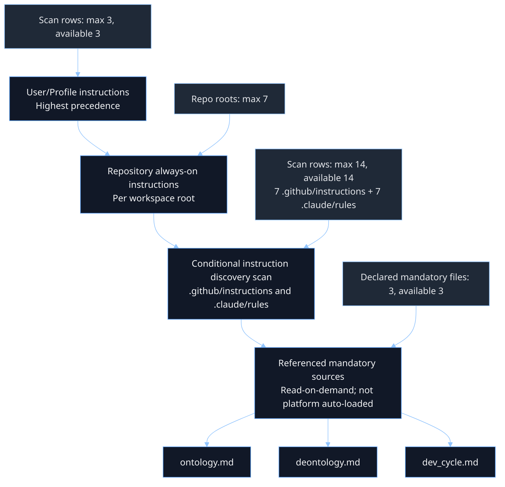

# Agent-Control Instruction Precedence and Coverage

Date baseline: 2026-05-07
Scope: Multi-root workspace (7 roots)

This README captures three things:
1. Actual precedence path used by Copilot in this workspace.
2. Max vs available row counts for each discovered source bucket.
3. What is always-on vs conditionally loaded.

## 1) Precedence Flow (Actual)

Interpretation:
- User/profile instructions override repository instructions when both exist.
- Repository always-on files are evaluated per workspace root.
- Conditional scans enumerate locations first; they only apply if matching files exist.
- Mandatory referenced files are binding by policy but require explicit read steps.

## 2) Discovery Row Counts (Exploded by Bucket)

These are location-row counts from the current discovery model (not file counts inside each location).

### 2.1 User Global Locations

| Location row | Max | Available now | Files present now |
|---|---:|---:|---:|
| `~/.copilot/instructions` | 1 | 1 | 0 |
| `~/.claude/rules` | 1 | 1 | 0 |
| User prompts folder | 1 | 1 | n/a |
| **User bucket subtotal** | **3** | **3** | **0 known instruction files** |

### 2.2 Workspace `.github/instructions` Location Rows

| Workspace root | Location row max | Location row available | `.instructions.md` files present |
|---|---:|---:|---:|
| `pers-ops-jvassar` | 1 | 1 | 0 |
| `dcc-pricing-supply` | 1 | 1 | 0 |
| `csl-pricing-supply` | 1 | 1 | 0 |
| `pdi-clone-core` | 1 | 1 | 0 |
| `citysv-prices` | 1 | 1 | 0 |
| `citysv-costs` | 1 | 1 | 0 |
| `gravitate-orders` | 1 | 1 | 0 |
| **.github/instructions subtotal** | **7** | **7** | **0** |

### 2.3 Workspace `.claude/rules` Location Rows

| Workspace root | Location row max | Location row available | rule files present |
|---|---:|---:|---:|
| `pers-ops-jvassar` | 1 | 1 | 0 |
| `dcc-pricing-supply` | 1 | 1 | 0 |
| `csl-pricing-supply` | 1 | 1 | 0 |
| `pdi-clone-core` | 1 | 1 | 0 |
| `citysv-prices` | 1 | 1 | 0 |
| `citysv-costs` | 1 | 1 | 0 |
| `gravitate-orders` | 1 | 1 | 0 |
| **.claude/rules subtotal** | **7** | **7** | **0** |

### 2.4 Discovery Totals

| Category | Max rows | Available rows now |
|---|---:|---:|
| User global rows | 3 | 3 |
| Workspace `.github/instructions` rows | 7 | 7 |
| Workspace `.claude/rules` rows | 7 | 7 |
| **Grand total** | **17** | **17** |

## 3) File Availability Counts (Exploded by Bucket)

### 3.1 Always-On Repository Files (`.github/copilot-instructions.md`)

| Workspace root | Present | Bytes | Lines | Est. tokens |
|---|---|---:|---:|---:|
| `pers-ops-jvassar` | Yes | 3,838 | 77 | 960 |
| `dcc-pricing-supply` | Yes | 3,422 | 54 | 856 |
| `csl-pricing-supply` | Yes | 3,422 | 54 | 856 |
| `pdi-clone-core` | Yes | 3,422 | 54 | 856 |
| `citysv-prices` | Yes | 3,422 | 54 | 856 |
| `citysv-costs` | Yes | 3,422 | 54 | 856 |
| `gravitate-orders` | Yes | 3,422 | 54 | 856 |
| **Always-on subtotal** | **7 / 7** |  |  |  |

### 3.2 Always-On If Present (`AGENTS.md`, `CLAUDE.md`)

| File type | Max possible in 7 roots | Available now |
|---|---:|---:|
| `AGENTS.md` | 7 | 0 |
| `CLAUDE.md` | 7 | 7 |

Sync note:
- `dcc-pricing-supply/agent-control/automation-index/Sync-CopilotInstructions.ps1` now syncs `CLAUDE.md` for the 6 COIL repos.
- `pers-ops-jvassar/CLAUDE.md` is currently maintained directly in that repo.

### 3.3 Conditional File Buckets

| File type | Availability model | Available now |
|---|---|---:|
| `.github/instructions/*.instructions.md` | Variable per repo | 0 |
| `.claude/rules/*` | Variable per repo | 0 |

## 4) Always-On vs Not Always-On

Always-on in this workspace:
- `.github/copilot-instructions.md` in each of the 7 roots.
- `CLAUDE.md` in each of the 7 roots.
- User memory preload (`/memories/preferences.md`, first 200 lines).

Always-on only if present:
- `AGENTS.md`

Presence status for optional always-on files:
- `AGENTS.md`: absent in all 7 roots.
- `CLAUDE.md`: present in all 7 roots.

Not always-on (conditional):
- `.instructions.md` files under `.github/instructions/` (requires discovery + apply conditions)
- `.claude/rules/*` rules (requires files present and applicable)

Binding but not platform auto-loaded:
- `csl-pricing-supply/semantic-index/ontology.md`
- `csl-pricing-supply/semantic-index/deontology.md`
- `dcc-pricing-supply/agent-control/primitives-index/agents/dev_team/runbooks/dev_cycle.md`

These are mandatory by policy and must be explicitly read by the agent workflow when applicable.

## 5) Instruction Capacity (What Space Is Left)

Short answer: there is no reliably published hard per-file markdown cap for always-on instruction files in Copilot chat.

Operationally, the real constraint is context-token budget. Very large always-on files can be truncated, summarized, or deprioritized when total context pressure is high.

### Measured Current Footprint (2026-05-07)

| File group | Bytes | Lines | Est. tokens | Notes |
|---|---:|---:|---:|---|
| `pers-ops-jvassar/.github/copilot-instructions.md` | 3,838 | 77 | 960 | Personal workspace root |
| COIL repo stub files (each of 6) | 3,422 | 54 | 856 | `dcc`, `csl`, `pdi-clone-core`, `citysv-prices`, `citysv-costs`, `gravitate-orders` |
| COIL canonical source (`COIL-Pricing-Supply/.github/copilot-instructions.md`) | 3,422 | 54 | 856 | Source used by sync script |

### Practical Headroom Model (Soft Budgets)

Use this as a safety model until/if Microsoft publishes strict hard caps.

| File group | Current est. tokens | Headroom to 2,000-token soft budget | Headroom to 4,000-token soft budget |
|---|---:|---:|---:|
| `pers-ops-jvassar/.github/copilot-instructions.md` | 960 | 1,040 | 3,040 |
| COIL repo stubs (each) | 856 | 1,144 | 3,144 |

Recommended guardrails:
- Keep each always-on file under about 2,000 tokens for strong reliability.
- 2,000 to 4,000 tokens is usually workable but increases risk under heavy context/tool usage.
- Above 4,000 tokens in always-on files should be treated as high-risk unless tested with debug traces.

### Token Math Cheat Sheet

Use this as an approximation, not an exact conversion:

| Text amount | Rough tokens |
|---|---:|
| 100 characters | 25 |
| 1,000 characters | 250 |
| 4,000 characters | 1,000 |
| 750 English words | 1,000 |

Fast estimate formula:
- Estimated tokens is approximately characters divided by 4
- Estimated characters is approximately tokens multiplied by 4

## 6) Quick Verification Checklist

1. Discovery rows show all 17 locations.
2. `.github/copilot-instructions.md` exists in all 7 roots.
3. If you add `AGENTS.md` or `CLAUDE.md`, verify they appear in active instruction context.
4. If you add `.instructions.md`, verify apply conditions are actually hit.
5. Verify mandatory referenced files are read in domain-relevant sessions.
